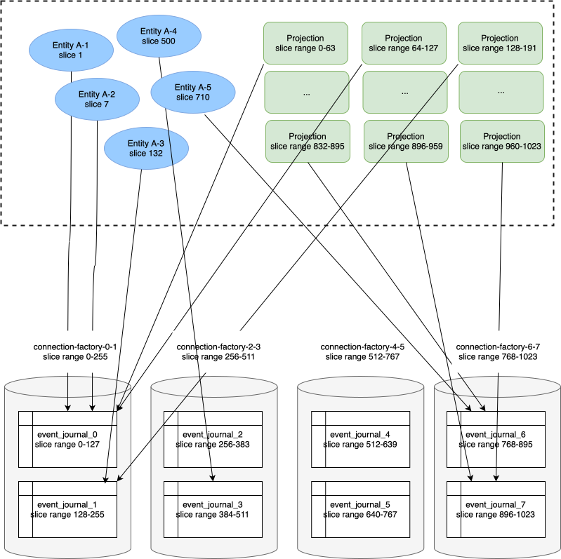

# Database sharding

Using a single non-distributed database can become a bottleneck for applications that have high throughput
requirements. To be able to spread the load over more than one database the event journal, snapshot store and
durable state can be split up over multiple tables and physical backend databases.

Without any application-level concerns or specific sharding features in the databases the R2DBC plugin has support for:

* database partitioning - vertical database scalability by multiple tables in one physical database
* database sharding - horizontal database scalability by distributing the data across multiple physical databases 

The data is partitioned by the slices that are used for @ref[`eventsBySlices`](query.md#eventsbyslices) and
@extref:[Projections](akka-projection:r2dbc.html). Events are grouped into slices based on a deterministic hash of the persistence identifier of the entity that emitted the event. There are 1024 slices, from 0 to 1023. A projection instance consumes events from a range of slices. For example, running 4 Projection instances the slice ranges would be 0-255, 256-511, 512-767, 768-1023. Changing to 8 slice ranges means that the ranges would be 0-127, 128-255, 256-383, …, 768-895, 896-1023.

You can configure how many data partitions that are needed.
A data partition corresponds to a separate database table. For example, 4 data partitions means that slice range
(0 to 255) maps to data partition 0, (256 to 511) to data partition 1, (512 to 767) to data partition 2,
and (768 to 1023) to data partition 3.

Number of data partitions must be between 1 and 1024 and a whole number divisor of 1024 (number of slices), e.g.
2, 4, 8, 16. Each data partition corresponds to a database table. The tables will have the data partition as suffix,
e.g. event_journal_0, event_journal_1.

Those tables can be located in physically separate databases. Number of databases must be a whole number divisor
of number of partitions, and less than or equal to number of partitions. For example, 8 data partitions and 2 databases
means that there will be a total of 8 tables in 2 databases, i.e. 4 tables in each database.

## Example

If we configure 8 data partitions and 4 databases it will look like this:



Based on the persistence id an individual entity will map to a specific slice and the entity will read and write to
the table that covers corresponding slice range.

If we have 16 projection instances each projection instance will consume events from 64 slices. The query to retrieve
events from these slices always map to one single table that covers the slice range. There can be more projection
instances than number of data partitions (tables), but not less. Less projection instances than number of data
partitions would result in queries that would span over more than one table, which would be inefficient and therefore
not allowed.

Each database may host several of the data partition tables. Each database requires a separate connection factory
and connection pool.

## Configuration

The data partitions are configured with:

@@snip [reference.conf](/core/src/main/resources/reference.conf) { #data-partition-settings }

When using more than one database you must define corresponding number of connection factories. The connection-factory
setting will have the data partition range as suffix, e.g. with 8 data partitions and
4 databases the connection factory settings would be:

```hcon
akka.persistence.r2dbc {
  data-partition {
    number-of-partitions = 8
    number-of-databases = 4
  }

  connection-factory = ${akka.persistence.r2dbc.postgres}
  connection-factory-0-1 = ${akka.persistence.r2dbc.connection-factory}
  connection-factory-0-1.host = ${?DB_HOST_0}
  connection-factory-2-3 = ${akka.persistence.r2dbc.connection-factory}
  connection-factory-2-3.host = ${?DB_HOST_1}
  connection-factory-4-5 = ${akka.persistence.r2dbc.connection-factory}
  connection-factory-4-5.host = ${?DB_HOST_2}
  connection-factory-6-7 = ${akka.persistence.r2dbc.connection-factory}
  connection-factory-6-7.host = ${?DB_HOST_3}
}
```

## Schema

Each data partition corresponds to a table. You can copy the DDL statements for the tables and indexes from
@ref[Creating the schema](getting-started.md#creating-the-schema) but change the table and index names to include
data partition suffix. For example `event_journal_0`, `event_journal_0_slice_idx`, `event_journal_1`, `event_journal_1_slice_idx`.
Note that the index must also reference the parent table with same data partition suffix.

## Changing data partitions

The configuration of data partitions and databases **must not** be changed in a rolling update, since the data must
be moved between the tables and databases if the configuration is changed. The application must be stopped while moving
the data.

The data can be copied between tables with SQL such as: 
```sql
CREATE TABLE event_journal_0 AS (SELECT * FROM event_journal WHERE slice BETWEEN 0 AND 127);
CREATE TABLE event_journal_1 AS (SELECT * FROM event_journal WHERE slice BETWEEN 128 AND 255);
```

Remember to also @ref[create the slice index](#schema).

Alternatively, @ref[create the tables](#schema) first and insert the data with SQL such as:
```sql
INSERT INTO event_journal_0 SELECT * FROM event_journal WHERE slice BETWEEN 0 AND 127;
INSERT INTO event_journal_1 SELECT * FROM event_journal WHERE slice BETWEEN 128 AND 255;
```

There are many other ways to move in an efficient way depending on what database you use, such as backups, sqldump and
other export/import tools.

The number of tables and their names don't change by the number of configured databases. If you think you will
need more than one database in the future it can be good to start with for example 8 data partitions (tables)
in a single database. That will make it easier to move the full tables to the additional databases later.
